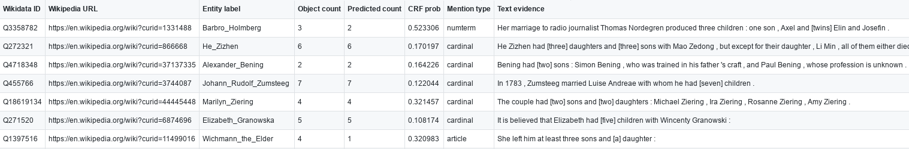

### Requirements
* Build the required CINEX JARs
```
ant -f CINEXPreprocessing.xml
ant -f CINEXClassifier.xml
ant -f CINEXEvaluation.xml
```
* Download and install [CRF++](https://taku910.github.io/crfpp/), then set the `$CRFPATH` in the bash scripts.
* Install [Tensorflow](https://www.tensorflow.org/) for experiments with bi-LSTM-CRF.

### Experiments on five relations

#### CRF
Please check the [`crf_experiments_five_rel/iswc_experiment_crf_five_rel.sh`](crf_experiments_five_rel/iswc_experiment_crf_five_rel.sh) bash script (which calls [`crf_experiments_five_rel/iswc_experiment_crf_per_relation.sh`](crf_experiments_five_rel/iswc_experiment_crf_per_relation.sh) and [`crf_experiments_five_rel/iswc_experiment_crf_per_relation_negation.sh`](crf_experiments_five_rel/iswc_experiment_crf_per_relation_negation.sh)--for **zero counting quantifiers**):
```
#!/bin/bash

#Five relations: containsWork (P527_Q7725310), containsAdmin (P150), hasMember (P527_Q2088357), 
#hasChild (P40) and P26 (hasSpouse)
sh iswc_experiment_crf_per_relation.sh P527_Q7725310 1.0 0.1
sh iswc_experiment_crf_per_relation.sh P150 1.0 0.2
sh iswc_experiment_crf_per_relation.sh P527_Q2088357 0.5 0.1
sh iswc_experiment_crf_per_relation.sh P40 0.5 0.1
sh iswc_experiment_crf_per_relation.sh P26 0.5 0.1

#Zero counting quantifier (negation): hasZeroChild (P40) and hasZeroSpouse (P26)
sh iswc_experiment_crf_per_relation_negation.sh P40 0.5 0.1
sh iswc_experiment_crf_per_relation_negation.sh P26 0.5 0.1
```
##### Performance Results
The performance results can be viewed in [`crf_experiments_five_rel/performance_crf_five_rel_manual.tsv`](crf_experiments_five_rel/performance_crf_five_rel_manual.tsv) and [`crf_experiments_five_rel/performance_crf_five_rel_neg.tsv`](crf_experiments_five_rel/performance_crf_five_rel_neg.tsv)--for **zero counting quantifiers**.

##### Predicted Counting Quantifiers
The predicted counting quantifiers for each relation are available in [`crf_experiments_five_rel/crf_five_rel_predicted/`](crf_experiments_five_rel/crf_five_rel_predicted/), in the format of tab-separated values (.tsv), e.g., for hasChild relation ([wdt:P40](https://www.wikidata.org/wiki/Property:P40)):



#### bi-LSTM-CRF
Please check the [`lstm_experiments_five_rel/iswc_experiment_lstm_five_rel.sh`](lstm_experiments_five_rel/iswc_experiment_lstm_five_rel.sh) bash script (which calls [`lstm_experiments_five_rel/iswc_experiment_lstm_per_relation.sh`](lstm_experiments_five_rel/iswc_experiment_lstm_per_relation.sh).

##### Performance Results
The performance results can be viewed in [`lstm_experiments_five_rel/performance_lstm_five_rel.tsv`](lstm_experiments_five_rel/performance_lstm_five_rel.tsv).

##### Predicted Counting Quantifiers

The predicted counting quantifiers for each relation are available in [`crf_experiments_five_rel/crf_five_rel_predicted/`](crf_experiments_five_rel/crf_five_rel_predicted/), in the format of tab-separated values (.tsv).

### Experiments on ~2.5K Wikidata relations

* Please check the [`experiments_wikidata_rel/iswc_prepare_feature_all_classes.sh`](experiments_wikidata_rel/iswc_prepare_feature_all_classes.sh) bash script to prepare the feature data for all entities in a given class (which calls [`experiments_wikidata_rel/iswc_prepare_feature_per_class.sh`](experiments_wikidata_rel/iswc_prepare_feature_per_class.sh))
* Please check the [`experiments_wikidata_rel/iswc_experiment_all_classes.sh`](experiments_wikidata_rel/iswc_experiment_all_classes.sh) bash script to run the experiments for all relations related to a given class (which calls [`experiments_wikidata_rel/iswc_experiment_per_class.sh`](experiments_wikidata_rel/iswc_experiment_per_class.sh))

##### Predicted Counting Quantifiers

The predicted counting quantifiers for each relation are available in [`experiments_wikidata_rel/all_rel_predicted/`](experiments_wikidata_rel/all_rel_predicted/), in the format of tab-separated values (.tsv), as for the previous five relations.

### Publication
Paramita Mirza, Simon Razniewski, Fariz Darari and Gerhard Weikum. *Enriching Knowledge Bases with Counting Quantifiers*. In Proceedings of ISWC 2018. [[pdf]](https://arxiv.org/pdf/1807.03656.pdf)

### Contact
For more information please contact [Paramita Mirza](http://paramitamirza.com/) (paramita135@gmail.com).
